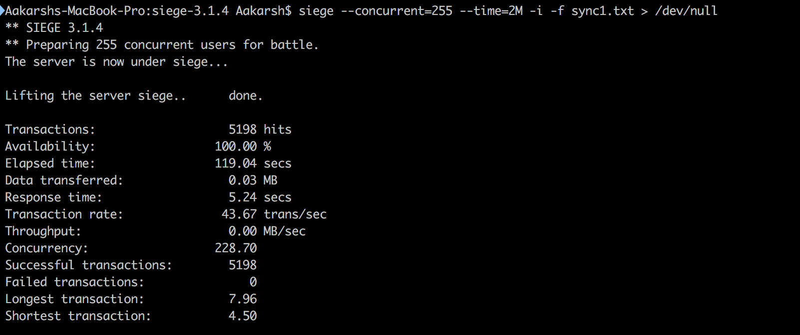
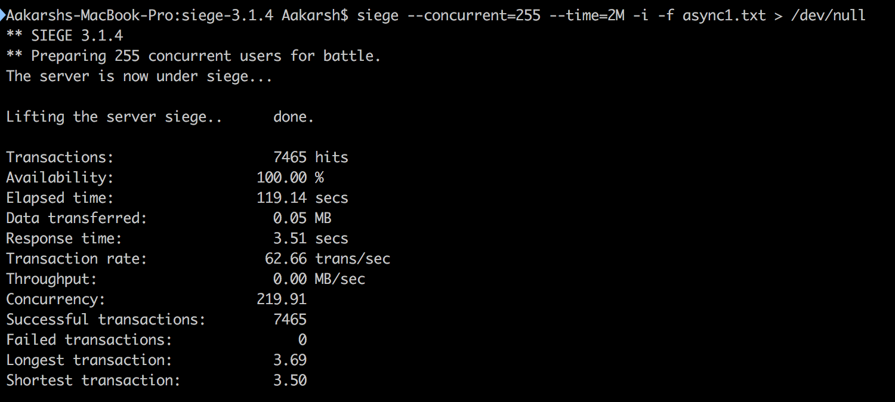

# Sharenotes

# Load testing:

Server had overall better performance with asynchronous methods when scaled compared to the syncronous methods.
Removing blocking tasks from main thread improved response time, transaction rate, # of hits, # of connections when scaled to 255 users.

Below are some tests using Siege load tester displaying results with the max (255) concurrent users. Internet mode is also enabled so real experience is shown.

# Sync API

# Async API

In a more intense load test (~12 minutes long with 255 concurrent users and internet mode) response times different by a factor of over 60%.

Its apparently the async API had a better scaling performance (longest transaction in async API is shorter than the shortest transaction in the sync API)
